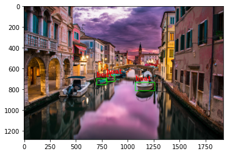

# OpenCV-Yolo3-Example

## Based on Elie Brosset's medium story 
https://medium.com/analytics-vidhya/recognizing-objects-in-images-using-python-and-yolov3-you-only-look-once-ce1d2a08d54c
### I introduced some very small changes

## Dependencies

- pip install matplotlib
- pip install numpy
- pip install opencv-python

## Network dependencies

- CFG file at: https://github.com/pjreddie/darknet/blob/master/cfg/yolov3.cfg
- Coco labels at: https://github.com/pjreddie/darknet/blob/master/data/coco.names
- Weights at: https://pjreddie.com/media/files/yolov3.weights

## Example

